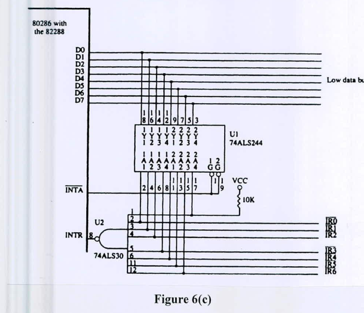

Figure 6(c) expands the interrupt structure of 8086 µP. (5+10=15)

i) What are the vector numbers for IR2 and IR5?

ii) Suppose the vector addresses for IR2 and IR5 are 4C215h and 13D2Bh respectively. If IR2 has higher priority than IR5 and both the interrupts are activated simultaneously, explain the priority resolution protocol.

