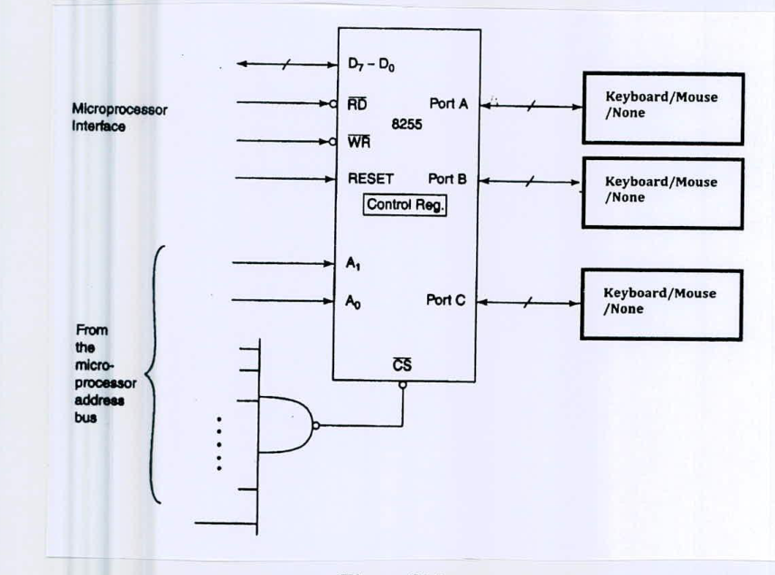

Chris wants to interface a mouse and a keyboard with his 8086 µP through an 8255 PPI. He wants to assign address A004h to the mouse and A005h to the keyboard. Complete the connection diagram of Figure 8(c) to help Chris successfully interface the devices.

