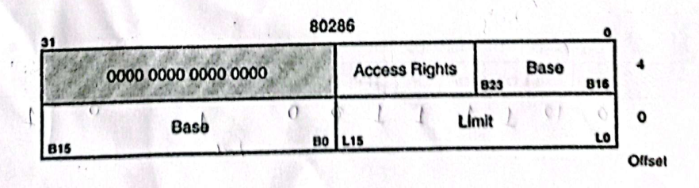

Carefully observe the memory snapshot of an 80286 microprocessor provided in the next page.

Assume that GDTR holds the value: 100000H, LDTR holds the value: 001CH, CS register holds the value: 0014H, IP register holds the value: 0020H. Now calculate the physical address of the instruction in Protected Mode. You **must** show the calculations necessary. For your reference the descriptor used in 80286 is given below:

| Physical Address (in hexadecimal) | +0 | +1 | +2 | +3 | +4 | +5 | +6 | +7 |
|:--|:-:|:-:|:-:|:-:|:-:|:-:|:-:|:-:|
| 100010 | FF | FF | 00 | 00 | 20 | FF | 00 | 00 |
| 100018 | FF | FF | 00 | 00 | 30 | FF | 00 | 00 |
| 100020 | FF | FF | 00 | 00 | 40 | FF | 00 | 00 |
| 200010 | FF | FF | 00 | 00 | 50 | FF | 00 | 00 |
| 200018 | FF | FF | 00 | 00 | 60 | FF | 00 | 00 |
| 300010 | FF | FF | 00 | 00 | 70 | FF | 00 | 00 |
| 300018 | FF | FF | 00 | 00 | 80 | FF | 00 | 00 |

*Each row gives the values (in hexadecimal) at the row's address +0 to +7. The paper lists one address per row, with "......" gaps after 100027 and 20001F.*
