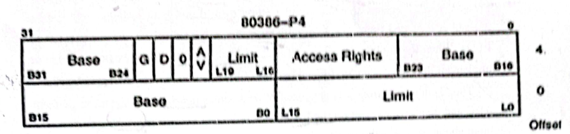

Carefully observe the following tables

**Global Descriptor Table:**

| Descriptor Index (as decimal) | Value (as hexadecimal) |
|:-:|:-:|
| 0 | 00 00 00 00 00 00 00 00 |
| 1 | 48D4 1A23 3216 321B |
| 2 | 321A 34BC 35BC 3254 |
| 3 | 1135 6413 3A52 31AB |
| 4 | 38D4 9A23 A216 320B |
| 5 | 1245 3513 1344 35CD |

**Page Directory Table:**

| Index (as decimal) | Value (as hexadecimal) |
|:-:|:-:|
| 353 | 00030000H |
| 354 | 00040000H |
| 355 | 00050000H |
| 356 | 00060000H |

**Page Table:**

| Index (as decimal) | Value (as hexadecimal) |
|:-:|:-:|
| 233 | 00010000H |
| 234 | 00090000H |
| 235 | 00080000H |
| 236 | 00070000H |

Given that CS:EIP = 0020H: 20AB10CD. Now Calculate the following physical addresses:

i) Physical address of the instruction.

ii) Page directory entry physical address.

iii) Page table entry physical address.

You **must** show the calculations necessary, for your reference the descriptor used in 80386 is given below:

