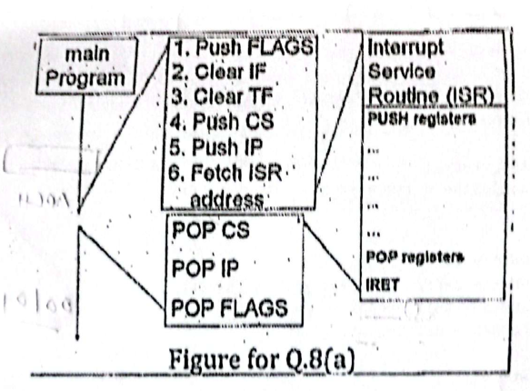

Is there anything wrong with the following interrupt handling procedure shown in figure Q. 8(a)? If yes, in which situation will it work despite the mistake?

*The figure shows: main program; on interrupt 1. Push FLAGS, 2. Clear IF, 3. Clear TF, 4. Push CS, 5. Push IP, 6. Fetch ISR address; the Interrupt Service Routine (ISR): PUSH registers ... POP registers, IRET; on return POP CS, POP IP, POP FLAGS.*
