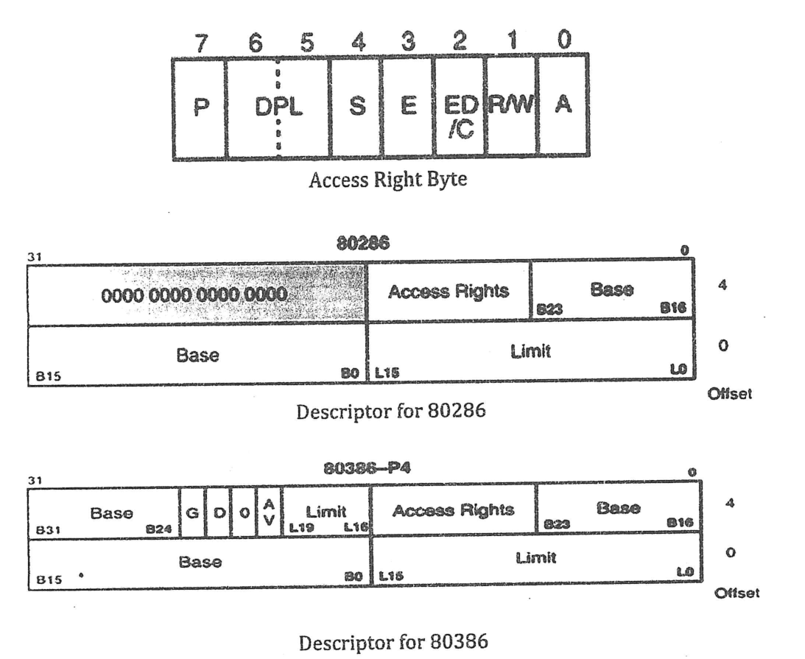

In an 80286 microprocessor, **DS** = 0014H, **GDTR** = 200000H, **LDTR** = 0018H

| Memory Address (in hex) | +0 | +1 | +2 | +3 | +4 | +5 | +6 | +7 |
|:--|:-:|:-:|:-:|:-:|:-:|:-:|:-:|:-:|
| 200000 | FF | FF | 00 | 00 | 50 | D2 | 00 | 00 |
| 200008 | FF | FF | 00 | 00 | 40 | D2 | 00 | 00 |
| 200010 | FF | FF | 00 | 00 | 30 | D2 | 00 | 00 |
| 300008 | FF | FF | 00 | 00 | 60 | 92 | 00 | 00 |
| 300010 | FF | FF | 00 | 00 | 70 | 92 | 00 | 00 |
| 300018 | FF | FF | 00 | 00 | 80 | 92 | 00 | 00 |

*Each row gives the bytes at the row's address +0 to +7 (the paper lists every address separately).*

Using the memory snapshots above, update the value of the shadow register for DS. You must show all the necessary calculations.

