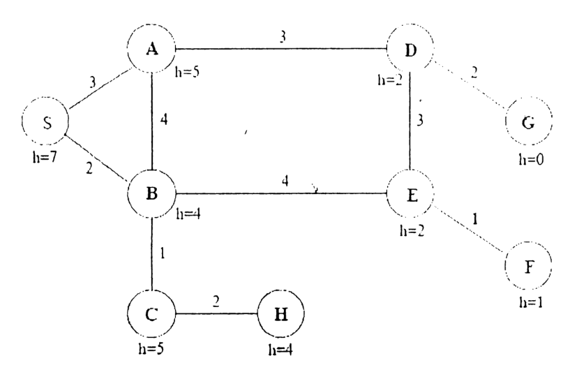

Consider the state space graph as shown in figure 2(c). All arcs are bidirectional. Arcs are labelled with the cost of traversing them and the value of an admissible heuristic function h, is shown along side each node. The start state is S and the goal is G. For each of the following search strategies, list, in order, all the states popped of the OPEN list. When everything else is equal, nodes should be removed from the OPEN list in alphabetic order.

(i) Iterative deepening depth first search

(ii) UCS

(iii) A*

(iv) Greedy best first search

| Edge | S-A | S-B | A-B | A-D | B-E | B-C | C-H | D-E | D-G | E-F |
|:--|:-:|:-:|:-:|:-:|:-:|:-:|:-:|:-:|:-:|:-:|
| Cost | 3 | 2 | 4 | 3 | 4 | 1 | 2 | 3 | 2 | 1 |

| Node | S | A | B | C | D | E | F | G | H |
|:--|:-:|:-:|:-:|:-:|:-:|:-:|:-:|:-:|:-:|
| h | 7 | 5 | 4 | 5 | 2 | 2 | 1 | 0 | 4 |
