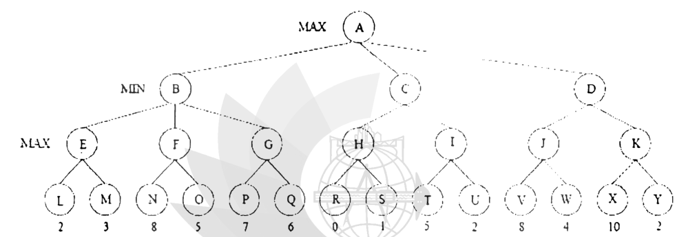

Consider the game tree as shown in figure 4(c). The root corresponds to a MAX node and the value of an evaluation function, if applied, are given at the leaves.

(i) What is the minimax value computed at the root mode for this tree?

(ii) What move should MAX choose?

(iii) Which nodes are not examined when Alpha-Beta pruning is performed? Assume children are visited from left to right.

*MAX A has MIN children B, C, D. B: MAX E (L = 2, M = 3), F (N = 8, O = 5), G (P = 7, Q = 6). C: MAX H (R = 0, S = 1), I (T = 5, U = 2). D: MAX J (V = 8, W = 4), K (X = 10, Y = 2).*
