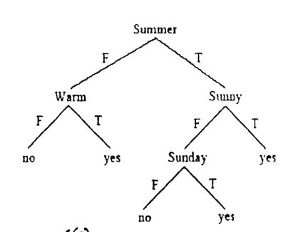

Given the following decision tree (in figure 6(c), for making a binary decision about whether or not to go on a bike ride, write a single sentence in propositional logic that expresses the same information, i.e. when to go on a bike ride.

*Root Summer. Summer = F: Warm (F: no, T: yes). Summer = T: Sunny (T: yes; F: Sunday (F: no, T: yes)).*
