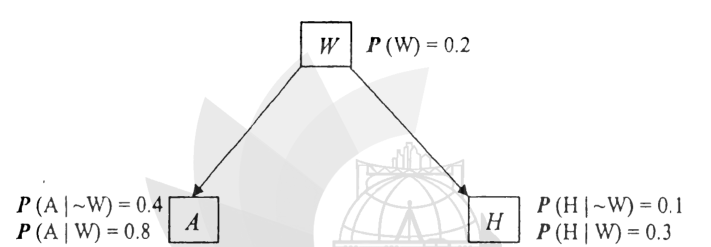

Consider the Bayesian Network shown in figure 7(c). Where variables W, A and H are all Boolean - valued. (4+8=12)

(i) compute $P(\neg A, W, H)$

(ii) compute $P(\neg A \mid H)$

*Edges: $W \to A$, $W \to H$. $P(W) = 0.2$; $P(A \mid \neg W) = 0.4$, $P(A \mid W) = 0.8$; $P(H \mid \neg W) = 0.1$, $P(H \mid W) = 0.3$.*
