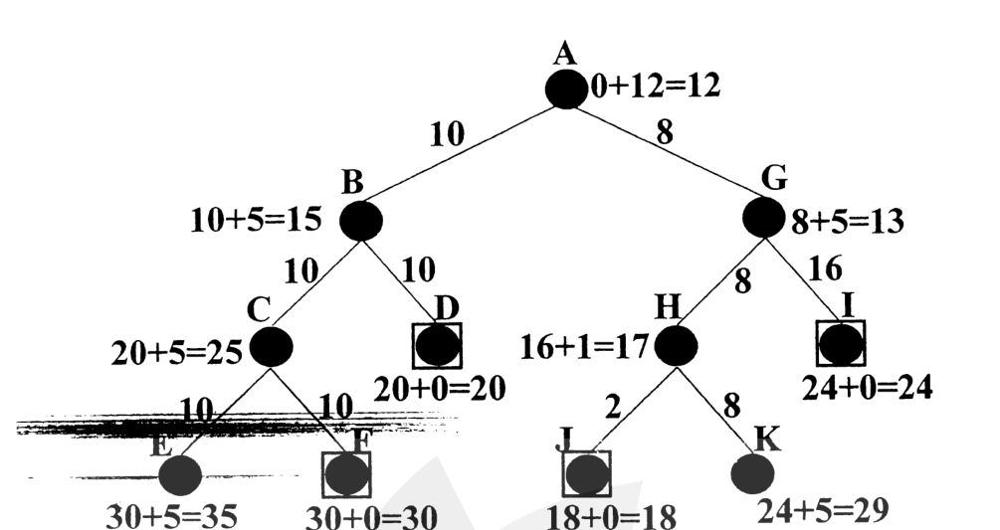

What are the characteristics of SMA* algorithm? Find the solution of the following graph using SMA* with a memory size of three nodes. Symbols carry the usual meanings. Justify your findings.

*Values are $g + h = f$; boxed nodes are goals. A: 0+12=12, with children B (edge 10) and G (edge 8). B: 10+5=15, children C (10) and D (10). C: 20+5=25, children E (10) and F (10). D (goal): 20+0=20. E: 30+5=35. F (goal): 30+0=30. G: 8+5=13, children H (8) and I (16). H: 16+1=17, children J (2) and K (8). I (goal): 24+0=24. J (goal): 18+0=18. K: 24+5=29.*
