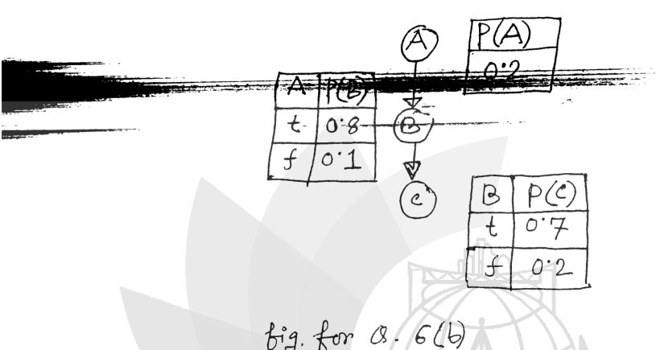

Consider the Bayesian network as shown in fig. for Q. 6(b). The network shows 3 boolean random variables and the conditional probability tables.

*Chain $A \to B \to C$. $P(A) = 0.2$; $P(B \mid A{=}t) = 0.8$, $P(B \mid A{=}f) = 0.1$; $P(C \mid B{=}t) = 0.7$, $P(C \mid B{=}f) = 0.2$.*

Now, compute the probability: $P(A = t \mid C = f)$.
