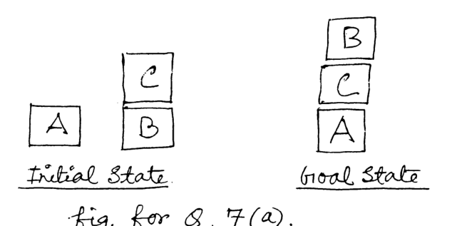

Consider an instance of the Blocks World Problem where the initial state and goal state are as shown in fig. for Q. 7(a). Now answer the following Questions:

(i) Write down STRIPS representation for initial state and goal state using appropriate literals. ($2\times2$=4)

(ii) Write down STRIPS representation for the following four actions: ($4\times2$=8)

(a) pickup(x): picks up a block x from top of table.

(b) putdown(x): puts down a block x on the table.

(c) Unstack(x,y): picks up a block x from top of another block y.

(d) stack(x,y): puts down a block x on top of another block y.

*Initial state: A on the table; C on B, B on the table. Goal state: B on C on A.*
