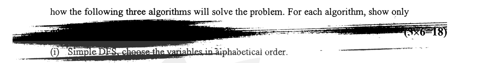

Suppose, the constraint graph for the map-coloring problem is as shown in fig. for Q. 8(b). We have to color the map using 3 colors Red (R), Green (G) and Blue (B). Show, how the following three algorithms will solve the problem. For each algorithm, show only ...

(i) Simple DFS, choose the variables in alphabetical order.

(ii) Forward Pruning DFS, use degree heuristic for variable ordering.

(iii) Forward Pruning DFS, use MRV (Minimum Remaining Value) heuristic for variable ordering.

For each algorithm, consider the color values in the order R, G, B.

*Edges: A-C, A-B, B-C, B-D, C-D, C-E, C-F, D-F, E-F.*
