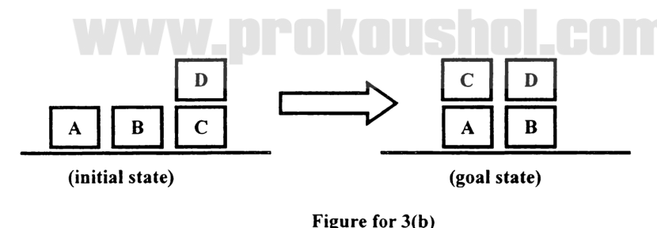

Using the goal stack planning and the actions defined in 3(a), attain the goal state from the initial state as shown in Figure for 3(b).

*Initial state: D on C; A, B and C on the table. Goal state: C on A, D on B; A and B on the table.*
