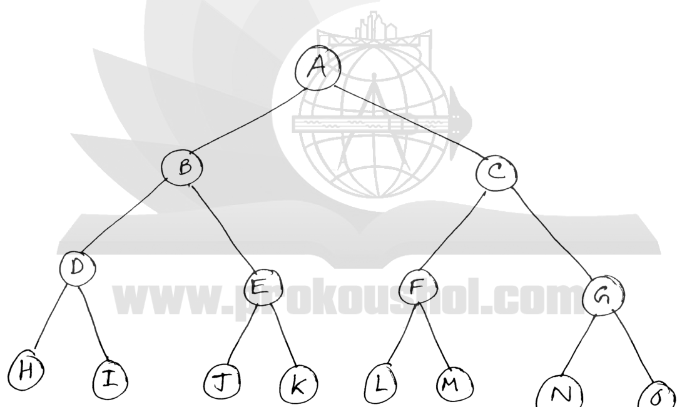

For the search tree (see figure 6(c)), perform an ITERATIVE DEEPENING SEARCH. Node M contains the GOAL STATE. You only need to show 5 trees for 5 limits.

*A binary tree: A has children B, C; B has D, E; C has F, G; D has H, I; E has J, K; F has L, M; G has N, O.*
