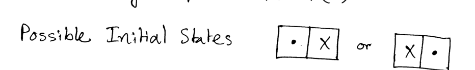

Consider the problem of question no. 7(a) again. Now, the agent is sensorless, and the grid is 2 by 1. Draw the reachable portion of Belief-State-Transition-Diagram. Recall meaning of X, V, Dot and See Fig. 7(c), for possible initial states.

*Possible initial states: [. X] or [X .].*
