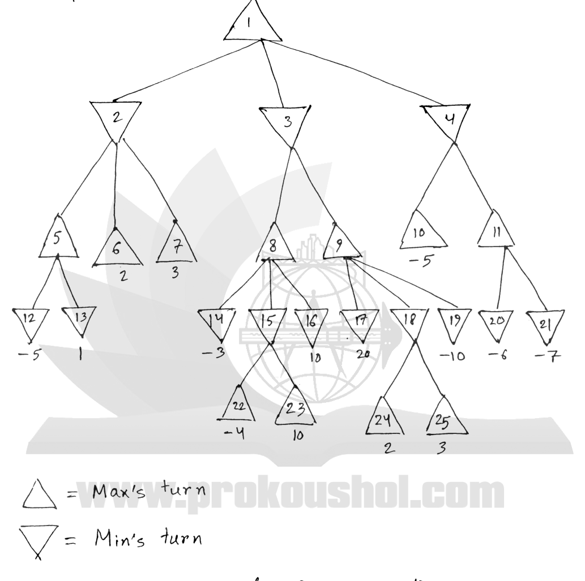

Using ALPHA-BETA Pruning, determine the MINIMAX value for the root node. Also, write which nodes will be pruned. See Figure 8(d) for the game-tree. All leaf nodes are terminal states, for which utility values are given. Child nodes are visited from the left to right.

*MAX node 1 has MIN children 2, 3, 4. Node 2: MAX 5 (MIN leaves 12 = $-5$, 13 = 1), MAX leaf 6 = 2, MAX leaf 7 = 3. Node 3: MAX 8 (MIN 14 = $-3$, MIN 15 with MAX leaves 22 = $-4$ and 23 = 10, MIN 16 = 10) and MAX 9 (MIN 17 = 20, MIN 18 with MAX leaves 24 = 2 and 25 = 3, MIN 19 = $-10$). Node 4: MAX leaf 10 = $-5$, MAX 11 (MIN leaves 20 = $-6$, 21 = $-7$).*
