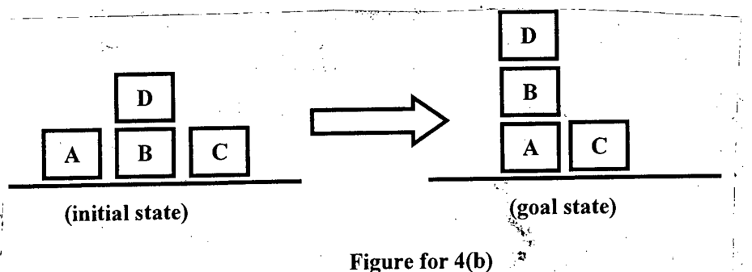

Using the goal stack planning and the actions defined in 4(a), attain the goal state from the initial state as shown in Figure for 4(b).

*Initial state: D on B; A, B and C on the table. Goal state: D on B on A; A and C on the table.*
