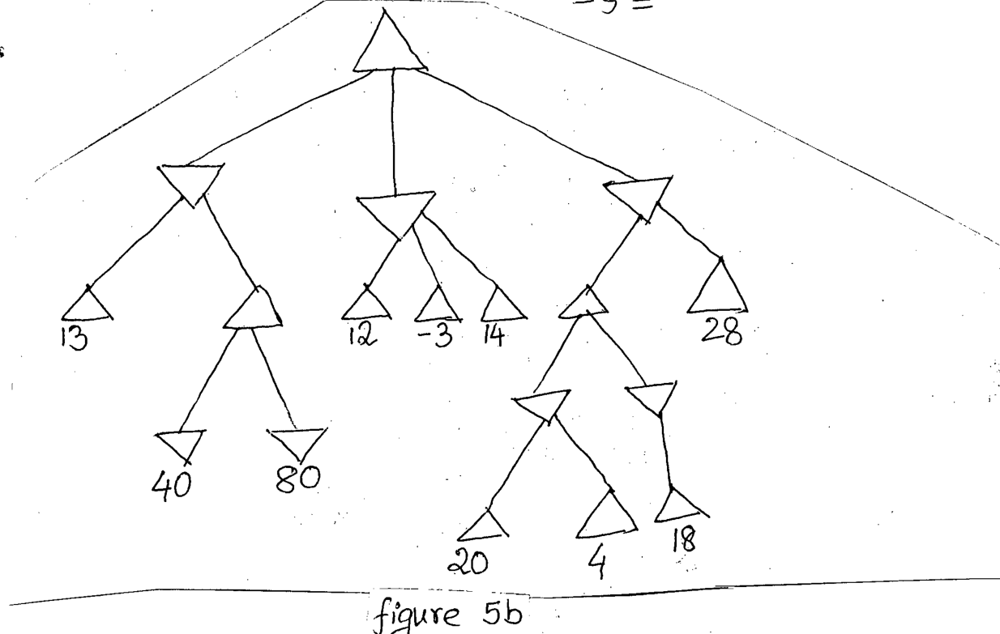

Consider the game tree in Figure 5b. Using ALPHA-BETA pruning determine the value for the root node. Also specify which branches are pruned by the algorithm. While expanding a node, children should be visited from left to right.

*Root MAX has three MIN children. MIN 1: leaf 13, and a MAX node whose MIN children are leaves 40 and 80. MIN 2: leaves 12, $-3$, 14. MIN 3: a MAX node (whose children are a MIN node with leaves 20 and 4, and a MIN node with leaf 18), and leaf 28.*
