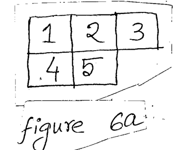

Consider the problem of assigning Red(R) and Green(G) colors to five squares on board in Figure 6a such that horizontally or vertically adjacent squares do not have the same color. ($3\times6$=18)

*Squares 1, 2, 3 in the top row; 4, 5 below 1 and 2.*

(i) State the variables, domains and constraints for this problem.

(ii) If initially Red color is assigned to square 1, what is the result of "Forward Checking" algorithm?

(iii) If initially Green color is assigned to square 5, what is the result of "Arc Consistency Checking" algorithm?
