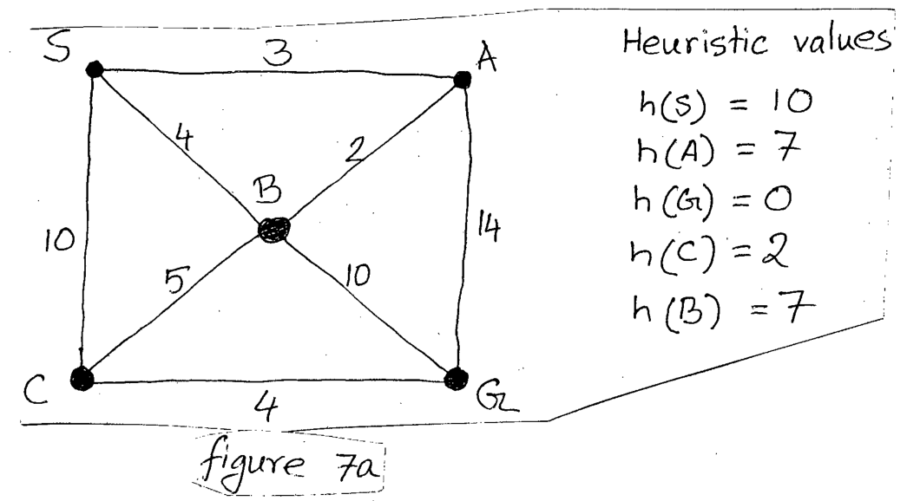

Perform Recursive Best First Search (RBFS) and Iterative Deepening A* Search (IDA*) algorithm to reach the goal state G from the initial state S for the graph and the heuristic values in Figure 7a. ($12\frac{1}{2}\times2$=25)

| Edge | S-A | S-B | S-C | A-B | A-G | B-C | B-G | C-G |
|:--|:-:|:-:|:-:|:-:|:-:|:-:|:-:|:-:|
| Cost | 3 | 4 | 10 | 2 | 14 | 5 | 10 | 4 |

*Heuristic values: $h(S) = 10$, $h(A) = 7$, $h(G) = 0$, $h(C) = 2$, $h(B) = 7$.*
