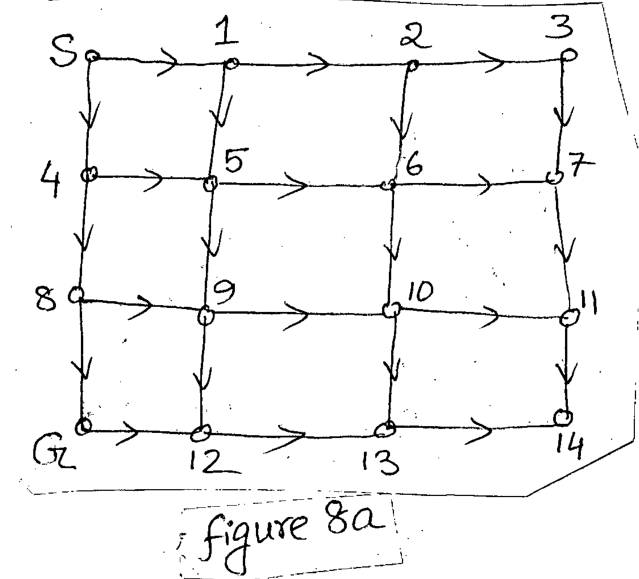

Perform the following searching algorithm in Figure 8a from initial state S to Goal State G.

*A $4\times4$ grid with directed edges going right and down. Top row: S, 1, 2, 3; second row: 4, 5, 6, 7; third row: 8, 9, 10, 11; bottom row: G, 12, 13, 14.*

(i) Breadth First Search (Right move has higher priority than Down)

(ii) Depth First Search (Right move has higher priority than Down)

(iii) Depth First Search (Down move has higher priority than Right)
