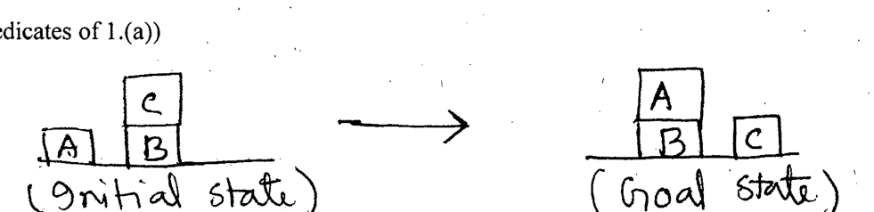

What are the differences between "forward state-space-search" and the "backward state-space-search"? Discuss using the following block-world problem. (Use actions and predicates of 1.(a))

*Initial state: C on B; A and B on the table. Goal state: A on B; B and C on the table.*
