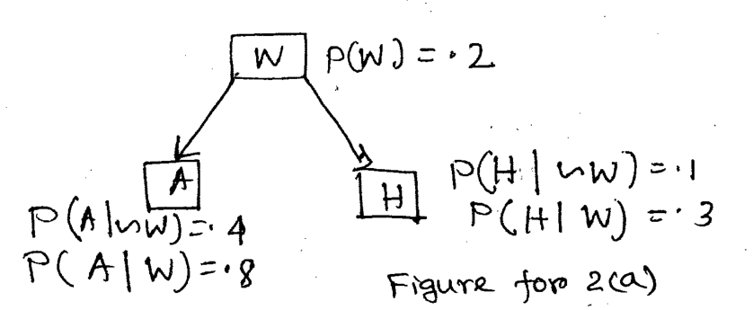

*Edges: $W \to A$, $W \to H$. $P(W) = .2$; $P(A \mid \neg W) = .4$, $P(A \mid W) = .8$; $P(H \mid \neg W) = .1$, $P(H \mid W) = .3$.*

For the above Bayesian Network compute (i) $P(\neg A, W, H)$ and (ii) $P(\neg A \mid H)$ where variables are W, A and H and these are all Boolean valued.
