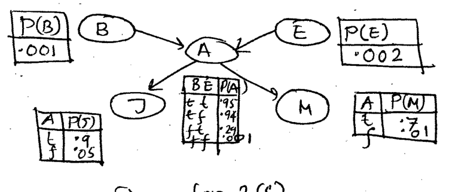

For the given Bayesian Network find the correctness of the following query, $P(B \mid J = \text{true}, M = \text{true})$ using variable elimination method. (Show the calculations).

*Edges: $B \to A$, $E \to A$, $A \to J$, $A \to M$. $P(B) = .001$, $P(E) = .002$.*

| B | E | P(A) |
|:-:|:-:|:-:|
| t | t | .95 |
| t | f | .94 |
| f | t | .29 |
| f | f | .001 |

| A | P(J) | P(M) |
|:-:|:-:|:-:|
| t | .9 | .7 |
| f | .05 | .01 |
