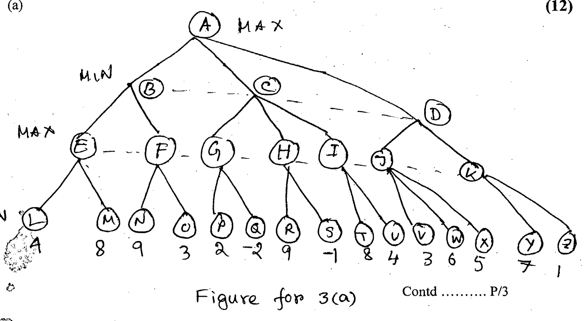

| Node (level) | Children (left to right) |
|:--|:--|
| A (MAX) | B, C, D |
| B (MIN) | E, F |
| C (MIN) | G, H, I |
| D (MIN) | J, K |
| E (MAX) | L = 4, M = 8 |
| F (MAX) | N = 9, O = 3 |
| G (MAX) | P = 2, Q = -2 |
| H (MAX) | R = 9, S = -1 |
| I (MAX) | T = 8, U = 4 |
| J (MAX) | V = 3, W = 6, X = 5 |
| K (MAX) | Y = 7, Z = 1 |

For the above game tree using "$\alpha$-$\beta$" pruning determine the value for the root node. Find the branches to be pruned while children are visited from the left to right. (Show the steps).
