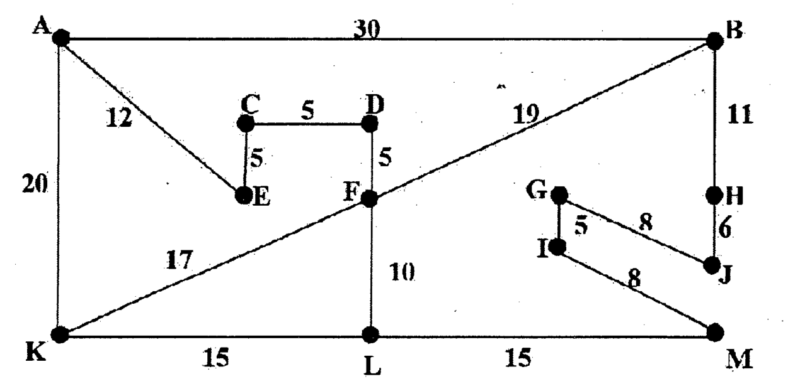

Consider the following map (not drawn to scale)

**Roads on the map**

| Road | A-B | A-E | A-K | C-D | C-E | D-F | K-F | F-B | F-L | K-L | L-M | B-H | H-J | G-J | G-I | I-M |
|:--|:-:|:-:|:-:|:-:|:-:|:-:|:-:|:-:|:-:|:-:|:-:|:-:|:-:|:-:|:-:|:-:|
| Length | 30 | 12 | 20 | 5 | 5 | 5 | 17 | 19 | 10 | 15 | 15 | 11 | 6 | 8 | 5 | 8 |

Use the A* algorithm to work out a route from town **A** to town **M**. The straight line distance between any town and town **M** is given in the following table.

| Town | Distance | Town | Distance |
|:-:|:-:|:-:|:-:|
| A | 56 | H | 10 |
| B | 22 | I | 8 |
| C | 30 | J | 5 |
| D | 29 | K | 30 |
| E | 29 | L | 15 |
| F | 30 | M | 0 |
| G | 14 | | |

(i) Provide the search tree for your solution, showing the order in which the nodes were expanded and the cost at each node. You should not re-visit a town that you have just come from. (10)

(ii) State the route you would take and the cost of that route. (05)

(iii) Is your chosen route optimal? State your reasons. (05)
