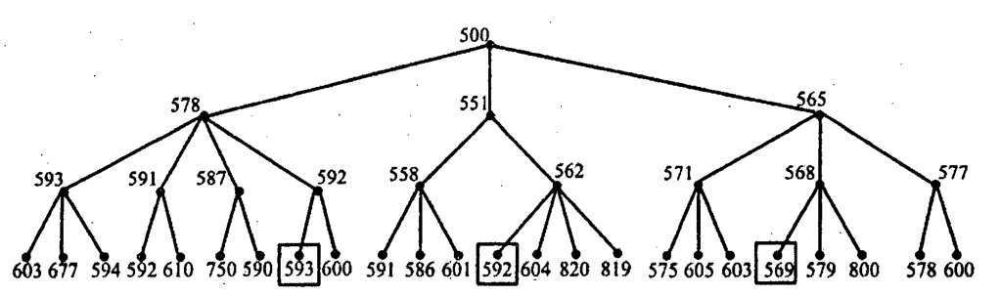

Consider the following search tree.

*Root 500 has children 578, 551 and 565. 578's children are 593 (leaves 603, 677, 594), 591 (leaves 592, 610), 587 (leaves 750, 590) and 592 (leaves [593], 600). 551's children are 558 (leaves 591, 586, 601) and 562 (leaves [592], 604, 820, 819). 565's children are 571 (leaves 575, 605, 603), 568 (leaves [569], 579, 800) and 577 (leaves 578, 600). Boxed (goal) nodes are shown in brackets.*

The numbers by the nodes denote the sum of some path cost and heuristic. The boxed nodes are goals. Describe in detail the way in which the RBFS algorithm searches this tree. Your answer should indicate the order in which nodes are expanded, the reason that this order is used, and should state which of the three goals is found and why. Note that smaller numbers represent more desirable nodes.
