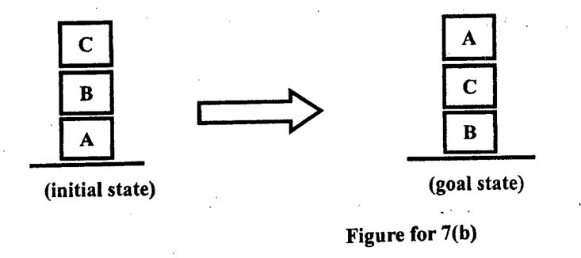

Using the goal stack planning and the actions defined in 7(a), attain the goal state from the initial state as shown in Figure for 7(b) (Consider that, both Agent1 and Agent2 work equally).

*Initial state: C on B on A (A on the table). Goal state: A on C on B (B on the table).*
