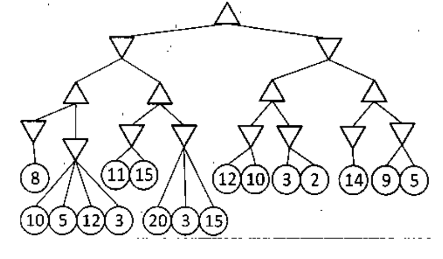

Consider the game tree below. Use **Alpha-Beta pruning** to determine the value for the root node. Clearly show which branches are pruned by the algorithm. While expanding a node, the children are to be visited from left to right.

*Root MAX has two MIN children; each MIN has two MAX children; each MAX has two MIN children. The eight bottom MIN nodes have these leaves, left to right: (8), (10, 5, 12, 3), (11, 15), (20, 3, 15), (12, 10), (3, 2), (14), (9, 5).*
