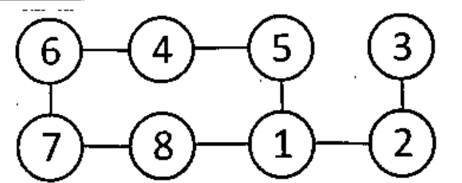

Consider the following constraint graph for the map coloring problem. Each node can be colored either with red or blue (except node 3). **Node 3 can only be colored with blue.**

Run backtracking algorithm with forward checking on this graph. And tabulate the assigned values and domains of different nodes as shown in the sample. The first 2 rows are already done for you. **Also indicate when the algorithm backtracks.** While coloring the graph, take nodes in increasing order of their label. That is, the algorithm will assign a value for node 1 first, then node 2, 3 and so on. You need to assign colors in the following order, **first red and then blue.** Mark the assigned values with circle.

*Edges: 6-4, 4-5, 5-1, 3-2, 6-7, 7-8, 8-1, 1-2.*

| | 1 | 2 | 3 | 4 | 5 | 6 | 7 | 8 |
|:--|:-:|:-:|:-:|:-:|:-:|:-:|:-:|:-:|
| Initial Domains | RB | RB | B | RB | RB | RB | RB | RB |
| 1: R | (R) | B | B | RB | B | RB | RB | B |
| ... | ... | ... | ... | ... | ... | ... | ... | ... |
