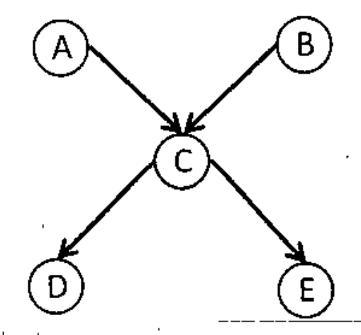

Consider the following Bayesian Network. Find out the probability of the following query: $P(B \mid D = \text{True}, E = \text{False})$

*Edges: $A \to C$, $B \to C$, $C \to D$, $C \to E$.*

The CPT (Conditional Probability Tables) are given below:

| P(B) | P(A) |
|:-:|:-:|
| 0.3 | 0.1 |

| A | B | P(C) |
|:-:|:-:|:-:|
| T | T | 0.95 |
| T | F | 0.94 |
| F | T | 0.29 |
| F | F | 0.01 |

| C | P(D) | P(E) |
|:-:|:-:|:-:|
| T | 0.90 | 0.7 |
| F | 0.05 | 0.01 |
