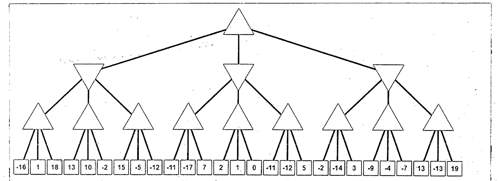

Prune the game tree shown in Figure for Q. 5(a) with alpha-beta pruning. The up-directed-triangle and down-directed-triangle denote MAX and MIN, respectively. Clearly show which branches are pruned by striking through the edges of the tree. Also show the values of alpha and beta at each node clearly. (18+2=20)

Which move will be taken by MAX at root?

*Note: The rectangular nodes represent terminal states and their labels indicate the utility values with respect to MAX.* (handwritten on the paper)

The tree as text: MAX root, three MIN children, each with three MAX children, each with three terminal states (left to right):

| MIN node | MAX child 1 | MAX child 2 | MAX child 3 |
|:--|:-:|:-:|:-:|
| Left | -16, 1, 18 | 13, 10, -2 | 15, -5, -12 |
| Middle | -11, -17, 7 | 2, 1, 0 | -11, -12, 5 |
| Right | -2, -14, 3 | -9, -4, -7 | 13, -13, 19 |
