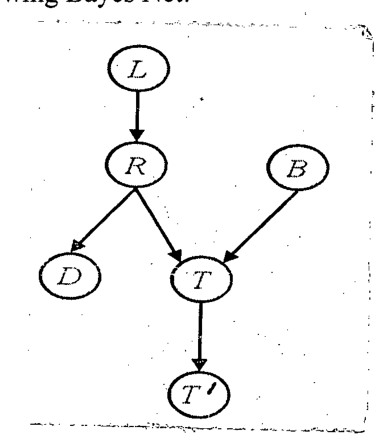

Given the following Bayes Net:

*Edges: $L \to R$, $R \to D$, $R \to T$, $B \to T$, $T \to T'$.*

Answer whether the following independence statements are true.

(i) $L \perp\!\!\!\perp T' \mid T$ (ii) $L \perp\!\!\!\perp B$ (iii) $L \perp\!\!\!\perp B \mid T$ (iv) $L \perp\!\!\!\perp B \mid T'$ (v) $L \perp\!\!\!\perp B \mid T, R$
