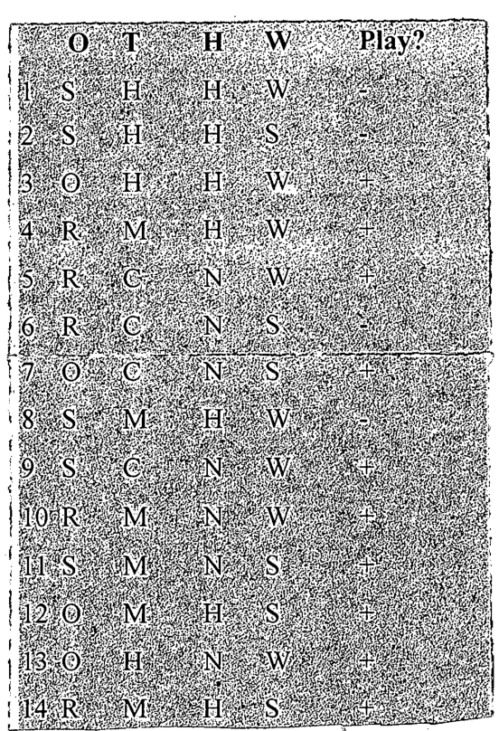

| # | O | T | H | W | Play? |
|:-:|:-:|:-:|:-:|:-:|:-:|
| 1 | S | H | H | W | - |
| 2 | S | H | H | S | - |
| 3 | O | H | H | W | + |
| 4 | R | M | H | W | + |
| 5 | R | C | N | W | + |
| 6 | R | C | N | S | - |
| 7 | O | C | N | S | + |
| 8 | S | M | H | W | - |
| 9 | S | C | N | W | + |
| 10 | R | M | N | W | + |
| 11 | S | M | N | S | + |
| 12 | O | M | H | S | + |
| 13 | O | H | N | W | + |
| 14 | R | M | H | S | + |

Consider the above dataset of 14 examples. In this example, we have four input attributes representing four columns O, T, H, and W to mean the following:

**O**utlook: S(unny), O(vercast), R(ainy)

**T**emperature: H(ot), M(edium), C(ool)

**H**umidity: H(igh), N(ormal), L(ow)

**W**ind: S(trong), W(eak)

Based on the values of different attributes, you will decide whether one should play (Yes (+) /No (-)) the basketball. In the above examples, real outcomes of 14 instances for Play is labeled as + or $-$ in the rightmost column. Now you need to build a decision tree based on the concept of information gain, where four columns O, T, H, and W are input variables and the Play column is considered as output. Show the calculation at each step of the tree construction.
