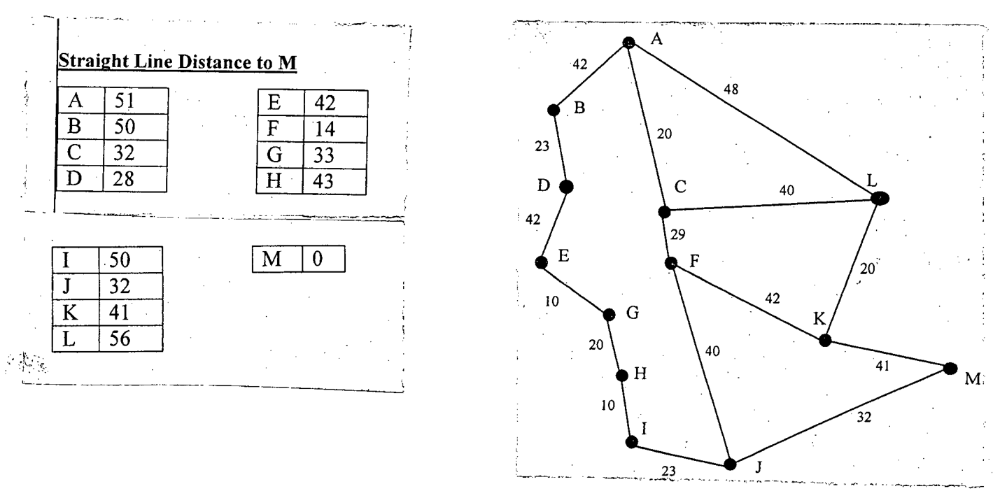

For the following map, using the A* algorithm, find a route from town A to town M. Show the search for your solution, showing the order in which the nodes were expanded and cost at each node. Assume previously visited states will not be re-visited. The Straight Line Distances between any town and town M are shown in the table below. Use it as a measure of the straight line distance heuristic.

**Straight Line Distance to M**

| Town | A | B | C | D | E | F | G | H | I | J | K | L | M |
|:--|:-:|:-:|:-:|:-:|:-:|:-:|:-:|:-:|:-:|:-:|:-:|:-:|:-:|
| SLD | 51 | 50 | 32 | 28 | 42 | 14 | 33 | 43 | 50 | 32 | 41 | 56 | 0 |

**Roads on the map**

| Road | A-B | A-C | A-L | B-D | D-E | E-G | G-H | H-I | I-J | C-F | C-L | F-K | F-J | L-K | K-M | J-M |
|:--|:-:|:-:|:-:|:-:|:-:|:-:|:-:|:-:|:-:|:-:|:-:|:-:|:-:|:-:|:-:|:-:|
| Length | 42 | 20 | 48 | 23 | 42 | 10 | 20 | 10 | 23 | 29 | 40 | 42 | 40 | 20 | 41 | 32 |
