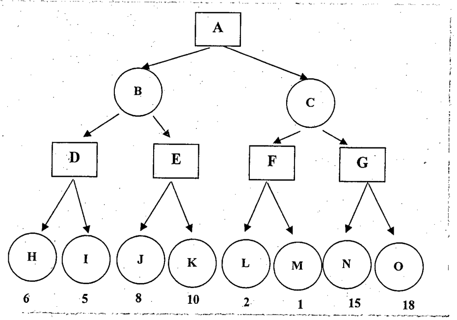

Given the following search tree, apply the alpha-beta pruning algorithm and show the search tree that would be obtained. Make sure that you show where the cuts are applied and which parts of the search tree are pruned as a result.



```text
                 [A]
          /               \
       (B)                 (C)
      /    \              /    \
   [D]      [E]        [F]      [G]
   / \      / \        / \      / \
 H=6 I=5  J=8 K=10   L=2 M=1  N=15 O=18

[ ] square node, ( ) circle node
```
