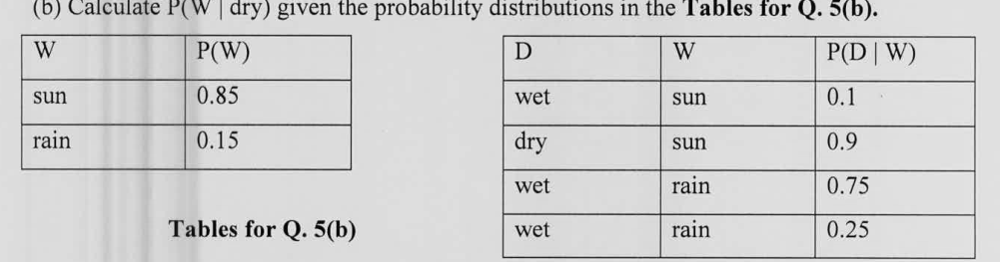

Calculate $P(W \mid dry)$ given the probability distributions in the **Tables for Q. 5(b).**

| W | P(W) |
|:--|:--|
| sun | 0.85 |
| rain | 0.15 |

| D | W | P(D \| W) |
|:--|:--|:--|
| wet | sun | 0.1 |
| dry | sun | 0.9 |
| wet | rain | 0.75 |
| wet | rain | 0.25 |

*Tables for Q. 5(b)*

