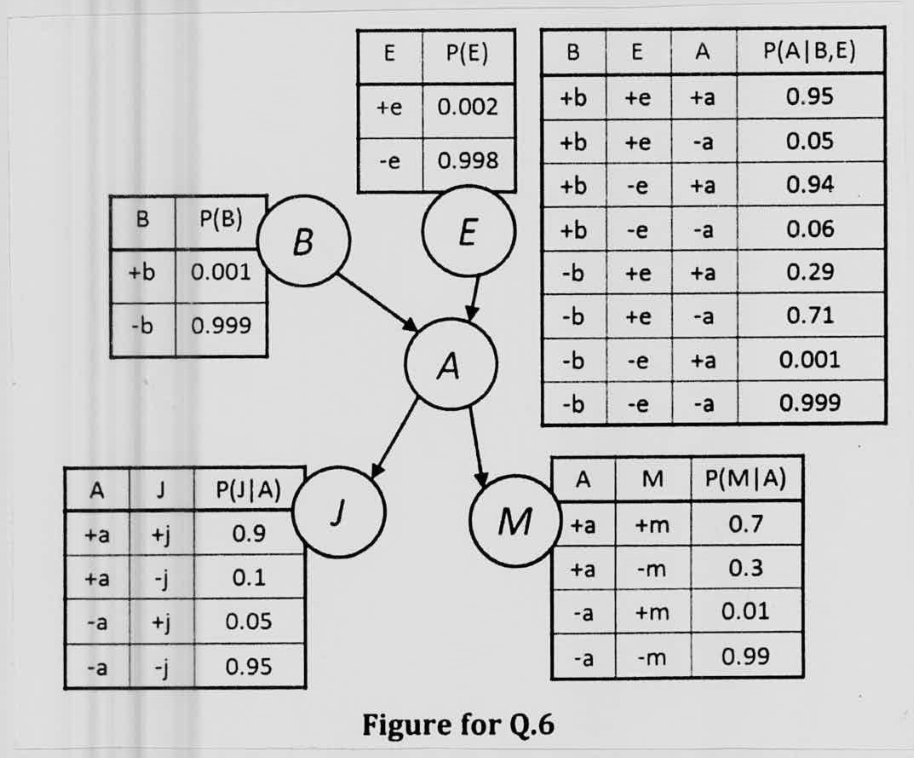

*Figure for Q.6: edges $B \to A$, $E \to A$, $A \to J$, $A \to M$. $P(+b) = 0.001$, $P(+e) = 0.002$.*

| B | E | P(+a \| B,E) |
|:-:|:-:|:-:|
| +b | +e | 0.95 |
| +b | -e | 0.94 |
| -b | +e | 0.29 |
| -b | -e | 0.001 |

| A | P(+j \| A) | P(+m \| A) |
|:-:|:-:|:-:|
| +a | 0.9 | 0.7 |
| -a | 0.05 | 0.01 |
