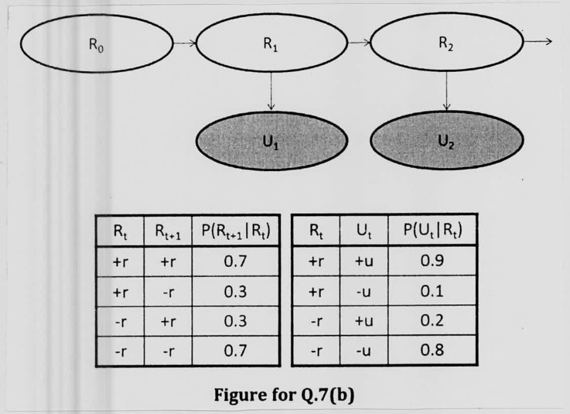

Consider the Hidden Markov Model shown in the **Figure for Q. 7(b).** Calculate the belief state at time step = 2, given the following information. Also, justify the statement, "Uncertainty accumulates as time passes and decreases as we get observations", from your calculation.

- Initial belief state: $B(R_0) = 0.6$ when $R_0 = +r$ and 0.4 when $R_0 = -r$.
- Observation at time step = 1: $U_1 = +u$
- Observation at time step = 2: $U_2 = -u$

| $R_t$ | $R_{t+1}$ | $P(R_{t+1} \mid R_t)$ |
|:-:|:-:|:-:|
| +r | +r | 0.7 |
| +r | -r | 0.3 |
| -r | +r | 0.3 |
| -r | -r | 0.7 |

| $R_t$ | $U_t$ | $P(U_t \mid R_t)$ |
|:-:|:-:|:-:|
| +r | +u | 0.9 |
| +r | -u | 0.1 |
| -r | +u | 0.2 |
| -r | -u | 0.8 |
