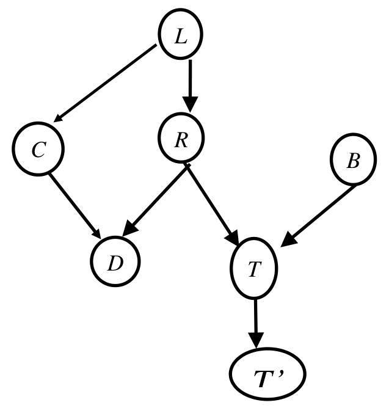

*Edges: $L \to C$, $L \to R$, $C \to D$, $R \to D$, $R \to T$, $B \to T$, $T \to T'$.*

Given the above Bayes net, answer whether the following independence statements are true.

(i) $L \perp\!\!\!\perp T' \mid T$

(ii) $L \perp\!\!\!\perp B \mid T$

(iii) $L \perp\!\!\!\perp B \mid T, R$

(iv) $L \perp\!\!\!\perp D$

(v) $L \perp\!\!\!\perp D \mid C$
