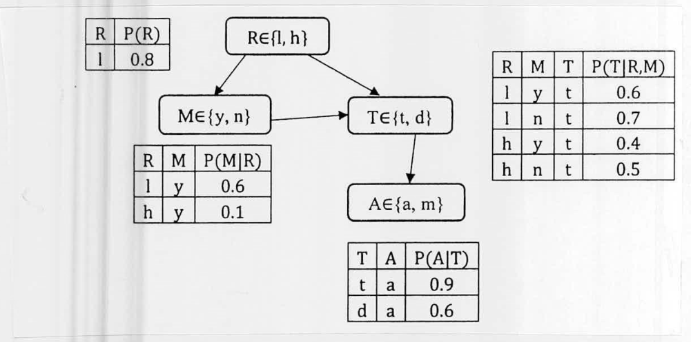

Consider the Bayesian Network and corresponding probability tables shown in Figure for Q.5(b). Now based on the observation T = d, calculate the updated probability distribution of M and R using inference by enumeration.

*Nodes: $R \in \{l, h\}$, $M \in \{y, n\}$, $T \in \{t, d\}$, $A \in \{a, m\}$. Edges: $R \to M$, $R \to T$, $M \to T$, $T \to A$.*

| R | P(R) |
|:-:|:-:|
| l | 0.8 |

| R | M | P(M\|R) |
|:-:|:-:|:-:|
| l | y | 0.6 |
| h | y | 0.1 |

| R | M | T | P(T\|R,M) |
|:-:|:-:|:-:|:-:|
| l | y | t | 0.6 |
| l | n | t | 0.7 |
| h | y | t | 0.4 |
| h | n | t | 0.5 |

| T | A | P(A\|T) |
|:-:|:-:|:-:|
| t | a | 0.9 |
| d | a | 0.6 |
