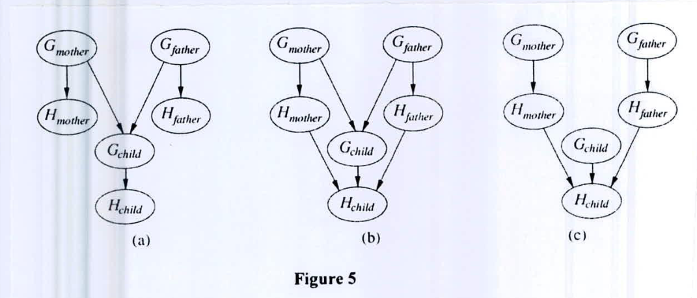

Let $H_x$ be a random variable denoting the handedness of an individual $x$, with possible values $l$ or $r$. A common hypothesis is that left- or right-handedness is inherited by a simple mechanism; that is, perhaps there is a gene $G_x$, also with values $l$ or $r$, and perhaps actual handedness turns out mostly the same (with some probability s) as the gene an individual possesses. Furthermore, perhaps the gene itself is equally likely to be inherited from either of an individual's parents, with a small nonzero probability $m$ of a random mutation flipping the handedness. (5+6+6=17)

(i) Show which of the three networks shown in Figure 5 satisfy the following equation:

$$P(G_{father}, G_{mother}, G_{child}) = P(G_{father})P(G_{mother})P(G_{child})$$

(ii) Compute the conditional probability table (CPT) for the $G_{child}$ node in network (a) (of Figure 5), in terms of $s$ and $m$.

(iii) Suppose the $P(G_{father} = l) = P(G_{mother} = l) = q$. in the given network (a) (of Figure 5), compute an expression for $P(G_{child} = l)$ in terms of $m$ and $q$ only, by conditioning on its parent nodes.

