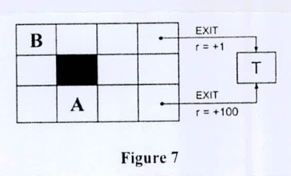

Figure 7 shows an instance of a grid world Markov decision process (MDP). Shaded cells represent walls. In all states, the agent has available actions UP ($\uparrow$), Down ($\downarrow$), Left ($\leftarrow$), and Right ($\rightarrow$). Performing an action that would transition to an invalid state (outside the grid or into a wall) results in the agent remaining in its original state. In states with an arrow coming out, the agent has an additional action *EXIT*. In the event that the *EXIT* action is taken, the agent receives the labeled reward and ends the game in the terminal state *T*. Unless otherwise stated, all other states generate no reward, and all transitions are deterministic (not stochastic). Let the discount factor be $\gamma = 1/2$.

Suppose that we are performing value iteration algorithm on the given grid world MDP. Assume that value iteration begins with all states initialized to zero, i. e., $U(s) = 0\ \forall s$. Compute the optimal utility values $U(s)$ for states (i.e., cells in the grid) A and B. Show the utility values $U(s)$ for all states after every iteration of the value iteration algorithm. Show the optimal policy.

*Figure 7: a $3\times4$ grid. B is the top-left cell; the wall is row 2, column 2; A is row 3, column 2. The top-right cell has EXIT with $r = +1$ and the bottom-right cell has EXIT with $r = +100$, both to T.*
