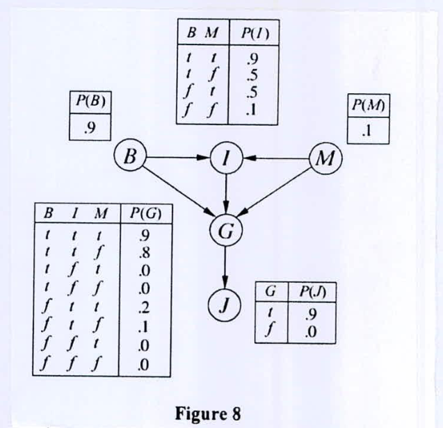

Consider the Bayes net shown in Figure 8 with Boolean variables $B$ = *BrokeElectionLaw*, $I$ = *Indicted*, $M$ = *PoliticallyMotivatedProsecutor*, $G$ = *FoundGuilty*, $J$ = *Jailed*. Using variable elimination algorithm, compute the probability that someone goes to jail given that they broke the law, have been indicted, and face a politically motivated prosecutor.

*Edges: $B \to I$, $M \to I$; $B, I, M \to G$; $G \to J$. $P(B) = .9$, $P(M) = .1$.*

| $B$ | $M$ | $P(I)$ |
|:-:|:-:|:-:|
| t | t | .9 |
| t | f | .5 |
| f | t | .5 |
| f | f | .1 |

| $B$ | $I$ | $M$ | $P(G)$ |
|:-:|:-:|:-:|:-:|
| t | t | t | .9 |
| t | t | f | .8 |
| t | f | t | .0 |
| t | f | f | .0 |
| f | t | t | .2 |
| f | t | f | .1 |
| f | f | t | .0 |
| f | f | f | .0 |

| $G$ | $P(J)$ |
|:-:|:-:|
| t | .9 |
| f | .0 |
