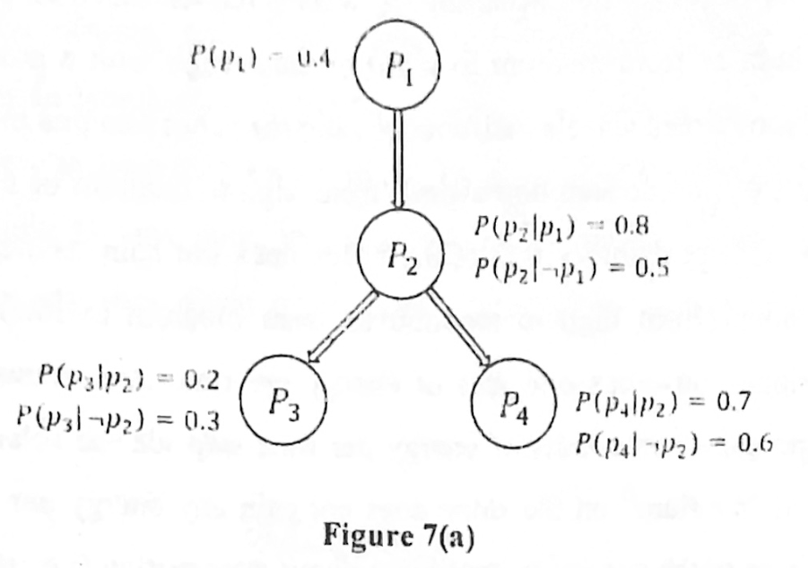

Consider the Bayesian network shown in Figure 7 (a).

*Edges: $P_1 \to P_2$, $P_2 \to P_3$, $P_2 \to P_4$. $P(p_1) = 0.4$; $P(p_2 \mid p_1) = 0.8$, $P(p_2 \mid \neg p_1) = 0.5$; $P(p_3 \mid p_2) = 0.2$, $P(p_3 \mid \neg p_2) = 0.3$; $P(p_4 \mid p_2) = 0.7$, $P(p_4 \mid \neg p_2) = 0.6$.*

Answer the following questions:

i. Compute the probability $P(p_1, \neg p_3, p_4)$ using inference by enumeration. Don't use the variable elimination method. Instead enumerate the necessary joint probability expressions and marginalize to compute the required probability.

ii. Compute the conditional probability $P(p_2 \mid \neg p_3)$. Apply the variable elimination method. Show all the computations.
