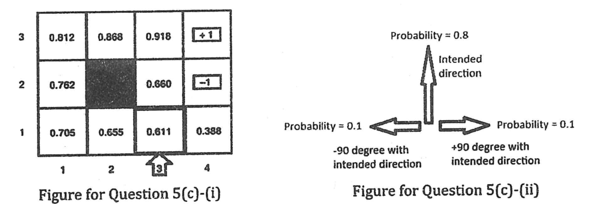

Once we tamed uncertainty using Bayesian modeling, the next task of the rover is to act rationally while maximizing utility. For simplicity we model the rover's world as a grid as in the Figure for Question 5(c)-(i) where 'arrow' marked cell is the current position of the rover. In this grid world, the rover wants to maximize its overall expected utility. The value of each cell is the maximal expected utility of that cell. The reward for each cell is $-0.04$ except for the $+1$ and $-1$ marked cells which are terminating cells. Moreover, the actions are also stochastic which is modeled as in the Figure for Question 5(c)-(ii). Now, considering the grid world, determine the optimal policy for the Opportunity rover. It would be sufficient to find the optimal policy for any 5 cells including the cell with rover.

| Row | Col 1 | Col 2 | Col 3 | Col 4 |
|:-:|:-:|:-:|:-:|:-:|
| 3 | 0.812 | 0.868 | 0.918 | +1 |
| 2 | 0.762 | (wall) | 0.660 | $-1$ |
| 1 | 0.705 | 0.655 | 0.611 (rover) | 0.388 |

*Figure 5(c)-(ii): the intended direction succeeds with probability 0.8; the rover moves at $-90^\circ$ or $+90^\circ$ to it with probability 0.1 each.*
