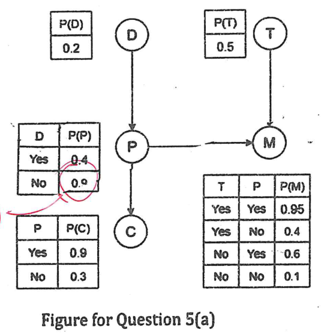

While doing exact inference in Question 5(b), you observed that it is time consuming and difficult. Thus, we resort to approximate inference technique. To this end, we sampled from the given Bayesian Network of Question 5(a) considering likelihood weighting and collected the following 10 samples:

| Sample 1 | Sample 2 | Sample 3 | Sample 4 | Sample 5 |
|:-:|:-:|:-:|:-:|:-:|
| +d, +t, +p, -m, -c | +d, -t, -p, +m, -c | +d, +t, +p, -m, -c | -d, -t, -p, -m, -c | -d, -t, -p, +m, -c |
| +d, -t, +p, +m, -c | -d, -t, -p, -m, -c | -d, -t, +p, +m, -c | -d, +t, -p, -m, -c | -d, -t, -p, -m, -c |

*The second row holds samples 6 to 10.*

Now, apply approximate inference to determine the probability of dust storms on Mars given unreliable communication considering symbols have their usual meaning.
