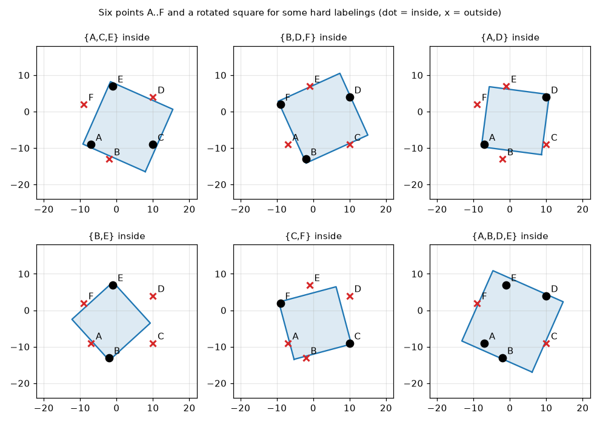

**Hypothesis space.** $H=\{h_{c,s,\theta}\}$, where $h_{c,s,\theta}(x)=1$ iff $x$ lies in the closed square with centre $c\in\mathbb{R}^2$, side $s>0$ and orientation $\theta$ (any position, size and rotation; 4 parameters). A set $S$ is *shattered* if every labeling of $S$ is produced by some square. $\text{VC}(H)$ is the size of the largest shattered set.

**Two useful facts.**

- A square is convex. If a point lies inside the convex hull of the others, labeling the hull points $+$ and it $-$ is impossible. So shattered sets must be in convex position.
- A very large square looks like a half-plane near the points. Any subset that a line can separate from the rest is therefore easy: it contains a "run" of consecutive hull vertices.

**$\text{VC}\ge5$: a regular pentagon (the standard answer).** Take $A=(0,1)$, $B=(-0.951,0.309)$, $C=(-0.588,-0.809)$, $D=(0.588,-0.809)$, $E=(0.951,0.309)$.

- $\varnothing$: a tiny square away from the points. Single points: a tiny square around the point.
- Consecutive vertices (for example $\{A,B\}$, $\{A,B,C\}$, $\{A,B,C,D\}$, all five): a line separates them from the rest, so a huge square with one side along that line works.
- Up to rotational symmetry and complement, the only non-consecutive subsets are a non-adjacent pair $\{A,C\}$ and a triple $\{A,C,D\}$ (the complement of the non-adjacent pair $\{B,E\}$).
- $\{A,C,D\}$: a square tilted $45^\circ$ (a diamond) with centre $(0,-0.30)$ and side $2.03$. It contains $A$ near its top corner and $C$, $D$ in its lower half, and leaves out $B$ and $E$: $|AC|=|BE|$, so $B$ and $E$ stick out of the sides.
- $\{A,C\}$: start from the $\{A,C,D\}$ square and rotate it slightly about $A$, so that $D$ leaves and $C$ stays. One such square has centre $(-0.07,-0.15)$, side $1.75$ and angle $41.8^\circ$.

All $2^5=32$ labelings are realized (checked by a script), so **the regular pentagon is shattered and $\text{VC}\ge5$**.

**$\text{VC}\ge6$: a six-point set (found and verified by computer).** Hopcroft's 2009 course notes say five points can be shattered and pose six as an open problem. Most course answers stop at 5. A search script, together with an independent check of every square it found, shows that the six points

$$A=(-7,-9),\ B=(-2,-13),\ C=(10,-9),\ D=(10,4),\ E=(-1,7),\ F=(-9,2)$$

**are** shattered by rotated squares. For all $2^6=64$ labelings there is a square with every $+$ point at least $0.27$ inside and every $-$ point at least $0.27$ outside (1.2% of the set's diameter, so this is not a rounding effect). The hardest labelings alternate around the hexagon:

| Inside | Angle | Side | Centre |
|:--|:-:|:-:|:-:|
| $\{A,C,E\}$ | $66.1^\circ$ | 18.73 | $(3.11,-4.15)$ |
| $\{B,D,F\}$ | $24.4^\circ$ | 18.61 | $(2.68,-1.81)$ |
| $\{A,D\}$ | $82.5^\circ$ | 16.64 | $(1.50,-2.50)$ |
| $\{B,E\}$ | $42.3^\circ$ | 15.24 | $(-1.50,-3.00)$ |
| $\{C,F\}$ | $14.9^\circ$ | 16.28 | $(0.50,-3.50)$ |
| $\{A,B,D,E\}$ | $66.1^\circ$ | 21.10 | $(0.72,-3.05)$ |

The other labelings (single points, runs of consecutive points, complements) are realized the same way. A regular hexagon does *not* work: its alternating labelings fail. The irregular shape above is needed.

**Upper bound.** Every square is a rectangle, so $H\subseteq$ rotated rectangles, whose VC dimension is 7. Hence $\text{VC}(H)\le7$. A random search over many 7-point sets in convex position found none that is shattered: the labelings that alternate around the hull always failed.

**Answer.**

$$\mathbf{6\ \le\ VC(\text{rotating squares})\ \le\ 7},\quad\text{with best estimate } \mathbf{VC=6}.$$

The largest shattered set exhibited is the 6 points above. If the course expects the classical answer, it is **5** (regular pentagon), and the pentagon argument above gives it.

*Notes:*

- *Assumption:* the squares may have any position, size and rotation, and contain their boundary.
- The 6-point result and the failure to shatter 7 points come from computation (exact containment tests over a fine grid of angles, with a positive margin), not from a published proof.
